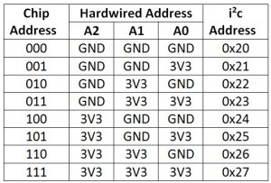
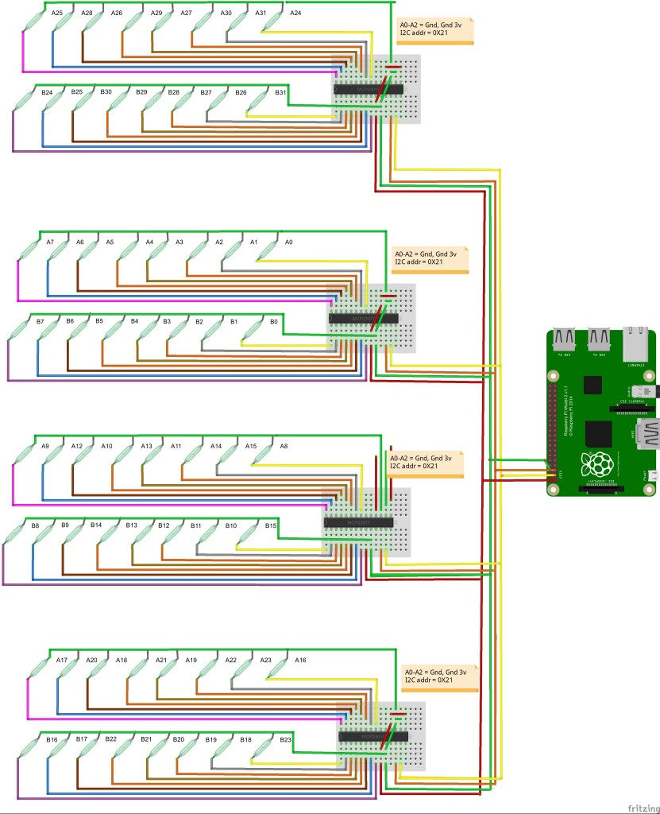
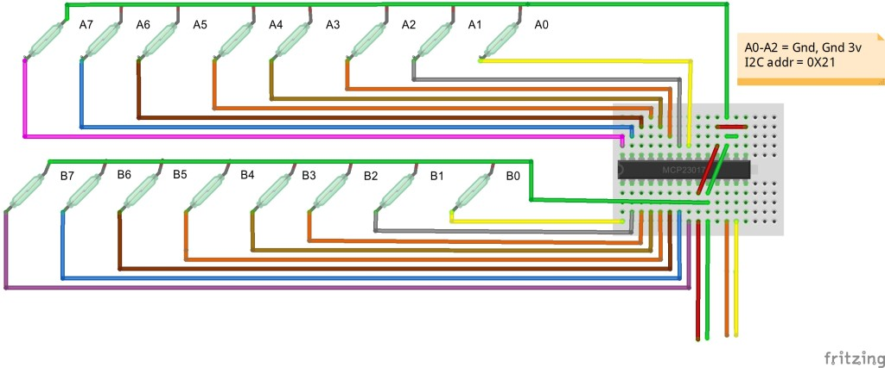

# Magnetic chessboard
The idea of chessboard based on 64 reed switchers, 4 MCP23018-E/SP and raspberry pi 3, sending pgn's by wifi.

## Board
First of all prepare your board


```
[ TLI49611 ] x16
   │  │
   │  └── OUT ────────────────┐
   │                           │
   └── VCC (3.3V)              │
   └── GND                     │
                               ▼
                    ┌─────────────────┐
                    │  MCP23017/18    │
                    │                 │
   Hall 1  ────────▶│ GPA0            │
   Hall 2  ────────▶│ GPA1            │
   ...              │ ...             │
   Hall 8  ────────▶│ GPA7            │
   Hall 9  ────────▶│ GPB0            │
   ...              │ ...             │
   Hall 16 ────────▶│ GPB7            │
                    │                 │
   A0,A1,A2 ───────▶│ adres I²C       │
   SDA ────────────▶│ SDA             │
   SCL ────────────▶│ SCL             │
   INT ────────────▶│ INT             │
                    └─────────────────┘
    
VCC  → 3.3V
GND  → GND
OUT  → pin MCP (GPAx / GPBx)

```


<!-- 
[instruction](http://chess.fortherapy.co.uk/home/design-ideas-for-easy-to-build-beaglebone-black-chess-computer-2/using-four-mcp23017s-to-control-64-reed-switches/)





 -->